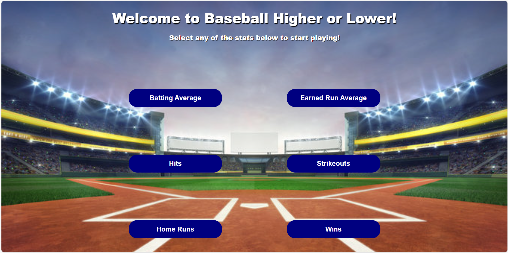

# Baseball Higher or Lower Game

## Table of Contents

- [Overview](#overview)
- [Features](#features)
- [Installation](#installation)
- [Usage](#usage)
- [Screenshots](#screenshots)
- [Contributing](#contributing)
- [License](#license)
- [Contact](#contact)
- [Acknowledgments](#acknowledgments)

## Overview

The Baseball Higher or Lower Game is an engaging and interactive web-based game where users test their knowledge of baseball players' statistics. The game presents players with two baseball players and a specific statistic, career batting average or career earned run average. The objective is to guess which player has the higher or lower value for the given statistic.

## Features

- **Intuitive Gameplay**: Simple and easy-to-understand mechanics, suitable for all ages.
- **Real-time Player Data**: Up-to-date statistics of all active baseball players through the MLB-StatsAPI.
- **Player Images**: Enhanced visual appeal of the game with images of almost every single player, sourced via web-scraping from BaseballReference.com.
- **Color-coded Player Identification**: Easily distinguish between players with color-coded names and borders around player images, ensuring clear association between statistics and players.
- **Real-time Feedback**: Immediate feedback on whether your guess was correct, enhancing the learning experience. 

## Installation

### Prerequisites

Ensure you have the following installed:
- Python 3.12.4
- All required Python packages listed in 'requirements.txt'

### Steps

1. Clone the repository:
```bash
git clone ____
```
2. Navigate to the project directory:
```bash
cd project-name
```
3. Create and activate a virtual environment:
```bash
python -m venv venv
source venv/bin/activate # On Windows use `venv/Scripts/Activate`
```
4. Install the required dependencies:
```bash
pip install -r requirements.txt
```
5. Run the project:
```bash
python app.py
```

## Usage

To start the project and access the live server, follow these steps:

1. Run the application:
```bash
python app.py
```
2. Access the live server:
Open your web browser and navigate to `http://127.0.0.1:5000`.

The project uses the MLB-StatsAPI to fetch real-time player-data. No additonal configuration for API keys is required as the API key is managed internally by the library.

## Screenshots

1. Screenshot of Home Page


2. Screenshot of Batting Average Higher or Lower Game


3. Screenshot of Correct Answer


4. Screenshot of Incorrect Answer


## Contributing

1. Fork the repository
2. Create a new branch:
```bash
git checkout -b feature-branch
```
3. Make your changes
4. Commit your changes:
```bash
git commit -m 'Add some feature'
```
5. Push to the branch:
```bash
git push origin feature-branch
```
6. Open a pull request

## License

This project is licensed under the MIT License. See the [LICENSE](LICENSE) file for the full text of the license.

## Contact

- Name: Jeremy Wint
- Email: wintjeremy@gmail.com
- Github: [JeremyWint](https://github.com/JeremyWint)

## Acknowledgments

- **MLB-StatsAPI**: For providing real-time players and statistics, which were essential for the functionality of this project.
- **BaseballReference.com**: For the player images that were scraped and used in this project.
- **higherorlowergame.com/mlb**: For the original idea behind the higher/lower game structure for baseball statistics.

Special thanks to all the contributors and sources that helped bring this project to life!
